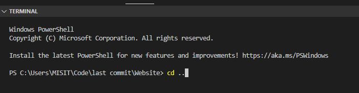

## Example Images

Home Page

Map

Simulation Start

Simulation in Progress

## How to run the project

---

The simulation is run by python, please install python in order to run the simulation\
After you have installed python, please run the following command to install the following package:

After you have installed python, please run "python --version" in cmd to make sure you have python installed.
Then run the following command to install the package from python required to run the simulation.

pip install numpy\
pip install scipy\
pip install matplotlib\
pip install gekko

---

Please Download Visual Studio Code

---

Please Download Node.js to run the API
please use the command "node-v" in cmd to verify that it is installed.

---

## PLEASE MAKE SURE YOU HAVE INSTALLED EVERYTHING ABOVE! ELSE THE API WILL NOT RUN

1. Download the files and put them into a folder\
2. Load the "Website" folder using Visual Studio Code, you need to do that else the submit button will cause a problem wit the server.\
   
3. Open terminal using Visual Studio Code\
   
4. Type cd.. to exit the "Website" folder\
   
5. Type cd Server\
   
6. Type cd src\
   
7. type node index.js, this should starts the API that communicate the javascript with the simulation model\
   
8. Download the Live Server add on from the Extension: MarketPlace on Visual Studio\
   
9. Choose the homePage.html, go to the bottom right of Visual Studio Code, there should be a go live button, click it. It should prompt a new webpage which is the homePage of the simulation. Click Ronarc and it should take you to the option selection page.\
   
   
   

YOU CAN CONTACT US IF YOU RUN INTO ANY PROBLEMS
